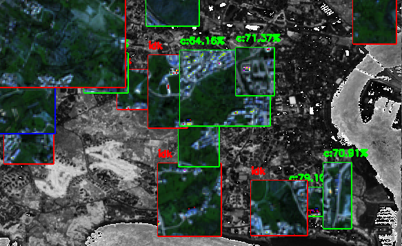

# EO_project
Classification of fields in satellite images

The main file is the Satellite_image_classification.ipynb notebook. 
The train_model.ipynb notebook is used to train the MobileNetV2 CNN with a small sample of data from the Functional Map of the World dataset (G. Christie, N. Fendley, J. Wilson, and R. Mukherjee, “Functional mapof the world,” inCVPR, 2018.) 
The sat_classifier.model file is the trained model with the images in the fmow_rgb folder. 
The folder gee_image_downloads is an auxiliary folder that stores rgb images that are used for the classification. 
 
Here is an example using an image of the city I live in :) 
 
 
 
Green squares represent regions classified as crop fields. 
Blue squares represent golf fields. 
Red squares represent regions of interest that couldn't be classified as either crop or golf fields with enough certainty. 
